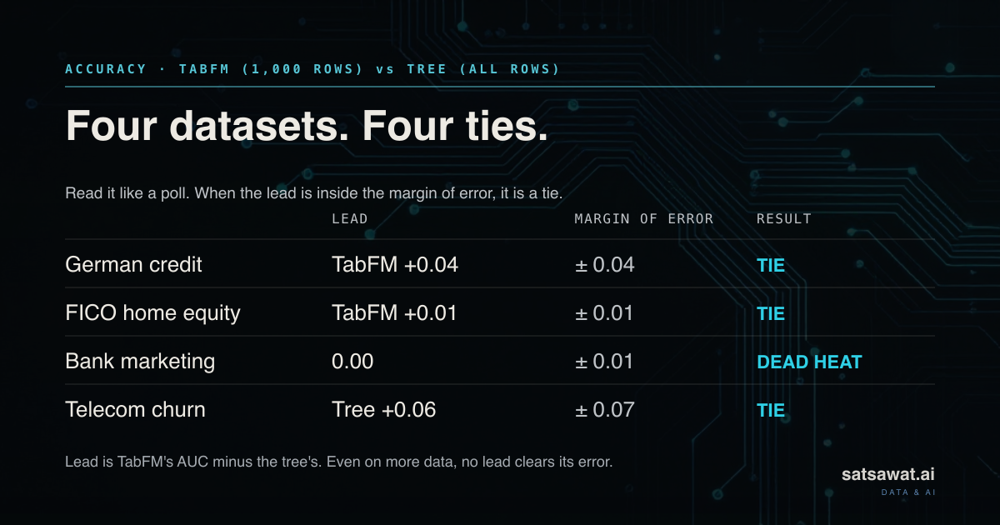
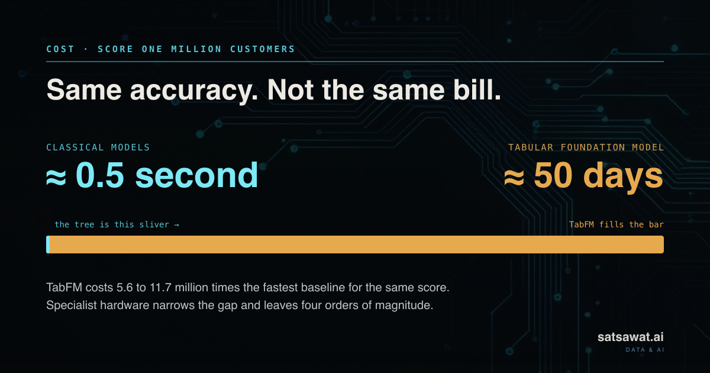
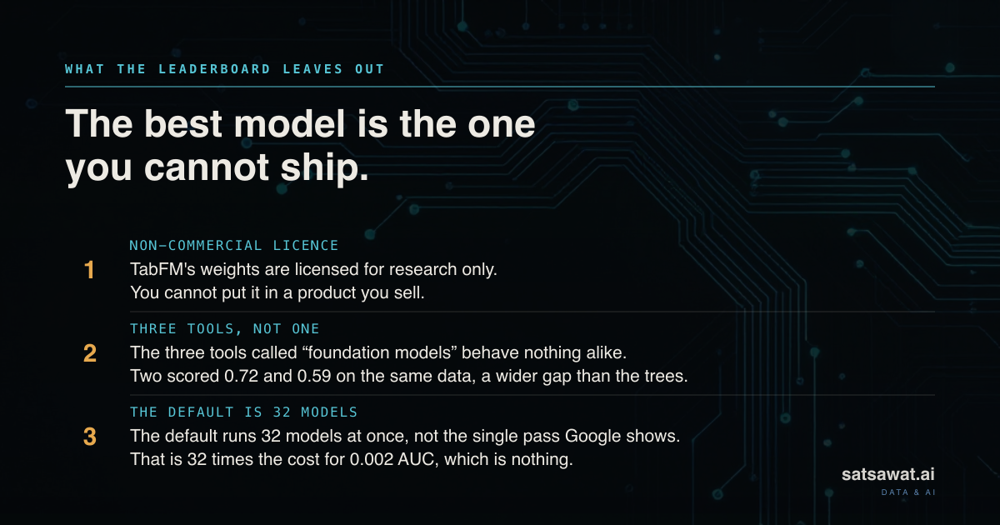
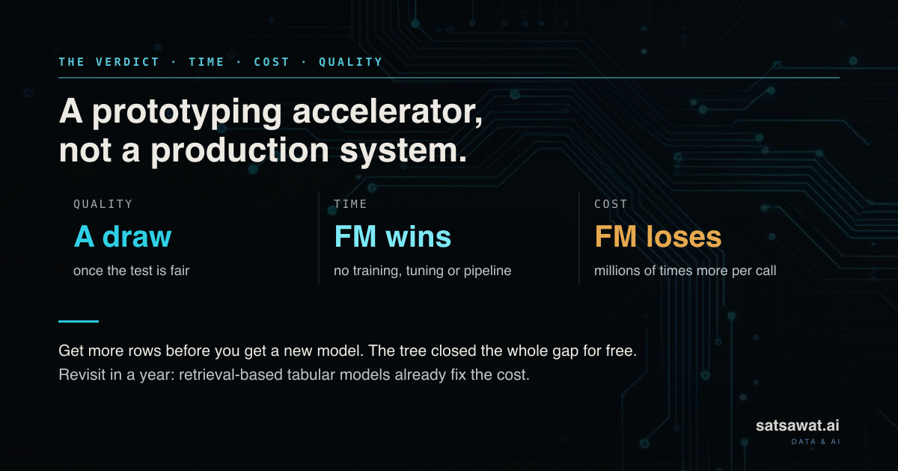

<p align="center">
  <a href="LICENSE"></a>
  <a href="https://www.python.org/"></a>
  
  
  <a href="https://satsawat.ai"></a>
</p>

# Tabular foundation models against gradient boosting, on real data

<p align="center">
  
</p>

Companion code for the writing at [satsawat.ai](https://satsawat.ai). Every number below is
recomputed from the committed results by a script that fails the build if any of them drift.

## Why this exists

Every problem gets an LLM thrown at it now. Summarise this, classify that, pull a field out
of the other thing, and lately, predict the number in this spreadsheet. Foundation models
earned that reflex on text and images, where they are genuinely hard to beat. The question I
could not answer was whether the reflex carries over to tabular data, which is where most
business prediction actually lives. Churn, fraud, credit risk, conversion. The
rows-and-columns problems a data science team is handed every week.

A new class of model says it does. Tabular foundation models like Google's TabFM promise to
delete the build-a-model step. No feature engineering, no training run, no tuning schedule.
You hand over the table and predictions come back. If that holds, it changes how tabular
machine learning gets staffed and shipped.

For twenty years the default answer to a tabular problem has been a gradient-boosted tree:
XGBoost, LightGBM, or CatBoost. So I wanted a straight answer to a straight question. On real
business data, with cost and licensing counted honestly, does a tabular foundation model
actually replace the tree, or does the reflex break the moment you look past the leaderboard?

This repository is that check.

## What this is

A small, self-auditing benchmark. Seven models run on four real OpenML datasets, on identical
splits, compared with a paired bootstrap and Holm correction, with prediction cost measured
as its own column next to accuracy.

Three tabular foundation models (TabFM, TabICL, TabDPT) go against three gradient-boosted
trees (XGBoost, LightGBM, CatBoost) and a logistic-regression floor. Every figure in this
file is recomputed from the committed artifacts by
[`scripts/verify_readme_claims.py`](scripts/verify_readme_claims.py), which fails on drift.
Check the claims rather than trust them.

## What it found



The leaderboard answer is that foundation models win. At the sizes these models can afford, a
foundation model takes the top score on all four datasets and clears correction on two.

| dataset | best model | vs strongest classical | survives Holm |
|---|---|---|---|
| `heloc` | TabFM 0.8247 | +0.0230 over logistic regression | yes, p = 0.0192 |
| `bank_marketing` | TabFM 0.9420 | +0.0194 over CatBoost | yes, p = 0.0288 |
| `credit_g` | TabDPT 0.7779 | +0.0244 over XGBoost | no, p = 0.7504 |
| `kdd_appetency` | TabFM 0.7164 | +0.0238 over logistic regression | no, p = 1.0000 |

Then I gave the tree the data it would actually have in production. The same LightGBM, trained
on every available row instead of the 1,000 the foundation models could handle, scored on the
identical test rows and compared with the same paired bootstrap:

| dataset | TabFM (1,000 rows) | tree (all rows) | tree rows | 95% CI on the gap | p |
|---|---|---|---|---|---|
| German credit | 0.76656 | 0.72259 | 700 | [-0.0870, +0.0000] | 0.0504 |
| FICO home equity | 0.82474 | 0.81495 | 9,459 | [-0.0235, +0.0039] | 0.1632 |
| Bank marketing | 0.94205 | 0.94205 | 44,211 | [-0.0077, +0.0076] | 0.9956 |
| Telecom appetency | 0.71635 | 0.77414 | 47,000 | [-0.0079, +0.1315] | 0.0868 |

Four datasets, four ties. On bank marketing the two scores are identical to the limit of
floating point. TabFM took 4,313 seconds per thousand predictions to draw level, which
against the fastest baseline on that dataset is 11,712,158 times the cost.

## What it costs



Seconds per 1,000 predictions, CPU.

| model | credit_g | heloc | bank_marketing | kdd_appetency |
|---|---|---|---|---|
| TabFM | 5,459.3300 | 4,627.9978 | 4,312.7678 | 8,702.0829 |
| TabICL | 5.5714 | 3.4587 | 2.8460 | 38.8713 |
| TabDPT | 0.6331 | 0.4047 | 0.3768 | 0.2267 |
| LightGBM | 0.0135 | 0.0091 | 0.0097 | 0.0065 |
| XGBoost | 0.0082 | 0.0033 | 0.0040 | 0.0037 |
| CatBoost | 0.0033 | 0.0011 | 0.0020 | 0.0038 |
| Logistic regression | 0.0015 | 0.0005 | 0.0005 | 0.0016 |

The gap is not an implementation detail. A tree learns from your data once and then predicts
cheaply forever. A foundation model never learns anything and re-reads your whole table on
every call, so your data is the running cost rather than the training input.

TabFM's shipped default is a 32-member ensemble, not the single forward pass its announcement
describes. Running both on `credit_g`: 1637.799 seconds against 51.297, for 0.0020 AUC.

## Two things the leaderboard hides



On the telecom data TabFM scored 0.7164 and TabICL scored 0.5867. Two tools sold under the
same label, 0.13 AUC apart on the same rows, a wider gap than the whole tree field showed.
"Tabular foundation model" is not one thing yet.

And the model that tops the leaderboard, TabFM, ships non-commercial weights. The strongest
result here is the one a business is least able to use, and no leaderboard has a column for
that. Check the licence before your data scientists benchmark, not after.

## The verdict



Any delivery lead knows the frame: time, cost, quality. On quality it is a draw once the
comparison is fair. Development time is where it genuinely wins, since there is
nothing to tune, retrain, or maintain. On serving cost it loses by orders of magnitude. Treat
today's tabular foundation models as a prototyping accelerator, not a production system, and
revisit as the tools improve.

## How it works

Nothing here trains a foundation model. `fit` does not learn weights. It reads your rows into
context and works out each answer from them fresh on every call. That is why cost grows with
the size of your data, and why the head-to-head comparison has to cap everyone at the same
small training set. A tree has no such cap in production, so the uncapped table above is the
comparison a business would actually face.

A few protocol choices move the numbers, and all of them are stated in the open:

**The tree libraries get their categorical features.** Each ran twice, once with native
categorical handling and once on ordinal codes, and the better run stands for that library.
This is not cosmetic: enabling it moved CatBoost on `bank_marketing` from 0.9118 to 0.9227 and
roughly halved the gap it is the control for.

**The control is picked after seeing the scores.** That maximises the reported gap in whichever
direction it points, so it is conservative for a win and anti-conservative for a loss.

**Holm runs within a dataset, not across the four.** The bootstrap quantifies uncertainty
within one split, not across resplits.

**The trees are untuned.** Fixed sensible settings, no search. A tuned baseline would narrow
every gap reported here, which cuts against the foundation model on the finding that matters
most.

**One seed, one split, CPU only.** These are not TabArena-grade measurements and are not meant
to be.

## How to run

New here? [`examples/tutorial.ipynb`](examples/tutorial.ipynb) is a short executed
walkthrough that loads a dataset, runs the classical models live, and reproduces the
four-way tie from the committed results, with every output saved in the notebook. To run
the full study yourself:

```bash
uv venv --python 3.12 .venv && VIRTUAL_ENV=.venv uv pip install -r requirements.txt
```

`requirements.txt` is a full lock pinned to the versions this study actually ran on, so an
install reproduces the environment exactly. `requirements.in` is the source list it compiles
from.

```bash
.venv/bin/python scripts/sweep.py --models logreg,xgboost,lightgbm,catboost,tabicl,tabdpt
```

```bash
.venv/bin/python scripts/compare.py && python3 scripts/verify_readme_claims.py
```

The datasets download themselves from OpenML on first use. Adding `--models tabfm` to the
sweep costs about six hours on CPU and roughly 7 GB of disk for the checkpoint.

```
scripts/datasets.py          the four real datasets, fetched from OpenML and cached
scripts/prep.py              the shared split, plus the three feature representations
scripts/run_one.py           one model, one dataset, one subprocess
scripts/sweep.py             the real-data sweep and its per-dataset protocol
scripts/compare.py           paired bootstrap against a control, Holm corrected
scripts/context_reference.py what a tree scores without the context cap
scripts/feature_baseline.py  how much of the target one column alone can recover
scripts/time_baselines.py    median-of-200 timing so cost ratios are not artefacts
scripts/smoke_test.py        the synthetic runnability bed, separate from the sweep
scripts/summarise.py         reads the probe JSONs, prints the tables
scripts/verify_readme_claims.py  recomputes every number here and fails on drift
```

Each probe runs in its own process, so an out-of-memory kill is recorded as a result rather
than ending the sweep, and peak memory belongs to one model instead of to whatever ran before
it.

## Disclaimer

This repository is a personal experiment, shared for education and reproducibility. It is not
production advice and not a formal benchmark. The scripts in `scripts/` rerun the whole
study, and the datasets fetch themselves from OpenML on first use, but everything runs on
one seed, one split, and a CPU. That is enough to show the answer changes from dataset to dataset and not
enough to rank these models in general. Treat the numbers as one careful data point and check
them against your own data before acting on them.

The field is also moving fast, so read the conclusion with a date on it. Tabular foundation
models are a real new capability, and what holds them back today is cost, not accuracy.
Retrieval-based approaches like TabDPT already show how that cost could come down. A future
model may well close the gap and start to replace tree-based pipelines for everyday tabular
work. That is not where things stand now. Today, once a gradient boosting model is given the
full dataset, it matches these models on accuracy and runs for a tiny fraction of the cost.
Use this repo to understand the tradeoff, and revisit it as the tools improve.

## What ran and what did not

| model | version | weights licence | ran |
|---|---|---|---|
| TabFM | 1.0.1 | non-commercial | yes |
| TabICL | 2.1.1 | BSD-3-Clause | yes |
| TabDPT | 1.2.0 | Apache-2.0 | yes |
| TabPFN | 8.4.0 | non-commercial by default | **no** |
| Nori | 0.18.2 | Apache-2.0 | **not applicable** |

TabPFN refuses to download weights without an interactive licence acceptance, so it cannot be
installed unattended and is absent from every result here. Nori 0.18.2 is regression only: its
API defines `Task = Literal["regression", "reg"]` and the package contains no reference to
classification.

Every TabFM cell is measured. The `kdd_appetency` run took 7 hours 15 minutes for 3,000
predictions.

## Also here

- [examples/tutorial.ipynb](examples/tutorial.ipynb) is a runnable walkthrough with its
  results saved in the notebook.
- [examples/foundation-model-live.ipynb](examples/foundation-model-live.ipynb) runs the
  foundation models live, end to end, with the thread-safety settings included.
- [FINDINGS.md](FINDINGS.md) is the full write-up.
- [RESEARCH-NOTES.md](RESEARCH-NOTES.md) is the lab journal, including the dead ends.
- [DATASET-CHOICE.md](DATASET-CHOICE.md) explains why the first dataset was thrown out of the
  comparison and kept only as a runnability check.
- [NOTICE.md](NOTICE.md) separates the code licence from the weight licences. The weights are
  not vendored and TabFM's cannot be used commercially.

## Author

Written by [Satsawat Natakarnkitkul](https://satsawat.ai), a data and AI practitioner in
ASEAN. Newsletter: [AI in Practice](https://satsawat.ai/#newsletter).

Companion repositories: [tsfm-bakeoff](https://github.com/netsatsawat/tsfm-bakeoff) asks the
same question of time-series foundation models, and
[agent-failure-lab](https://github.com/netsatsawat/agent-failure-lab) does it for compound
error in agents.
